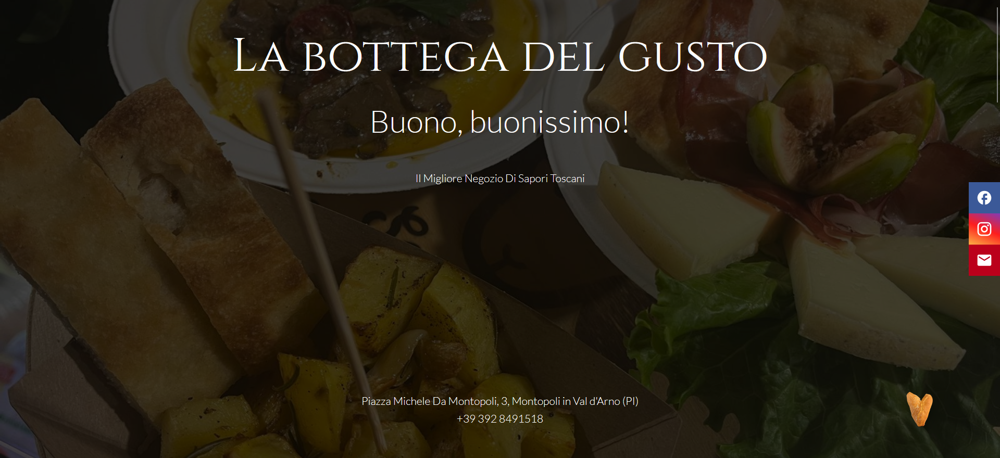

# La Bottega del Gusto

🌐 **Live**: [labottegadimontopoli.it](https://labottegadimontopoli.it)  
📅 In produzione dal 22 aprile 2026

Sito vetrina e gestionale per **La Bottega del Gusto**, bottega alimentare di Montopoli in Val d'Arno (PI). Rimpiazza un sito HTML statico precedente con un'applicazione Laravel moderna, ottimizzata per ricerca locale e gestibile in autonomia dal personale della bottega.

## Screenshot

<p align="center">
  
  
</p>

## Stack

- **Laravel 12** (PHP 8.4)
- **PostgreSQL 17** in container Docker
- **Filament 3** per il pannello admin
- **Spatie Sitemap** + **Spatie Schema.org** per SEO
- **Nginx** host come reverse proxy + Let's Encrypt per HTTPS

## Features principali

- **Pannello admin Filament** pensato per utenti non-tecnici, con form Repeater per gestire eventi, orari settimanali (fasce multiple per giorno) e chiusure straordinarie
- **SEO locale strutturato**: Schema.org `FoodEstablishment` + `OpeningHoursSpecification` dinamica dal DB + `EventSeries` ricorrente, sitemap XML, Open Graph, meta geo
- **Design mobile-first responsive**: layout a 3 colonne su desktop che collassa in stack verticale su tablet/mobile (breakpoint 900px e 767px), hero fullscreen adattato, carosello eventi con scroll-snap orizzontale su touch, immagini ottimizzate con `object-position` diversa su mobile per non perdere soggetti in foto verticali
- **Badge "Aperto ora" dinamico** calcolato server-side in timezone `Europe/Rome`, inclusi gli intervalli con chiusura pomeridiana e le chiusure straordinarie
- **Cookie banner GDPR-compliant** (linee guida EDPB 03/2022): pari evidenza visiva su "accetta tutti" / "solo necessari", gating preventivo dell'embed Google Maps, cookie policy veritiera
- **Nessuna dipendenza npm in produzione**: CSS e JS vanilla self-hosted, font Cinzel + Lato serviti direttamente, scelta deliberata per ridurre attack surface e costi di manutenzione
- **Integrazione Too Good To Go** con UTM tracking per misurare l'impatto del sito sulle prenotazioni Magic Box

## Architettura

Laravel monolitico server-rendered (no SPA): Blade + Livewire via Filament. Scelta architetturale deliberata — il sito è una vetrina + admin light, non giustifica la complessità di una architettura API-first. La scelta ha reso possibile SEO locale ottimale out-of-the-box senza SSR custom.

Deploy Docker: 2 container (`app` PHP 8.4-FPM + `db` PostgreSQL 17). Nginx host fa reverse proxy e termina TLS, il container app non è mai esposto direttamente.

## Avvio in locale (Docker)

Requisiti: Docker e Docker Compose.

```bash
cp .env.example .env
docker compose up -d --build
docker compose exec app php artisan key:generate
docker compose exec app php artisan storage:link
```

- App: http://localhost:8001
- Admin: http://localhost:8001/admin
- Postgres: `127.0.0.1:5434`

Per creare il primo utente admin:

```bash
docker compose exec app php artisan make:filament-user
```

## Avvio in locale (senza Docker)

```bash
composer install
npm install
cp .env.example .env
php artisan key:generate
php artisan migrate
php artisan storage:link
composer dev   # avvia server + queue + logs + vite
```

## Struttura

```
app/
  Filament/Resources/    # Resource admin (es. EventResource)
  Http/Controllers/      # HomeController, EventController, SitemapController
  Models/                # Event
resources/views/
  layouts/app.blade.php  # Layout base con <head> SEO
  pages/                 # home, cookie-policy, events/index, events/show
  partials/              # hero, about, events, contact, socials, schema
  components/            # event-card, cookie-banner
public/
  css/main.css           # CSS statico
  js/hero-slider.js      # Slider hero
  images/                # Foto bottega
routes/web.php           # /, /eventi, /eventi/{slug}, /cookie-policy, /sitemap.xml
```

## Deploy

Deploy su VPS Debian, con altri progetti Docker in parallelo. Pattern adottato:

- Progetti in `~/apps/<nome>/`
- Nginx host (fuori Docker) come reverse proxy, un vhost per dominio in `/etc/nginx/sites-available/`
- Let's Encrypt con rinnovo automatico (certbot systemd timer)
- PostgreSQL bindato su `127.0.0.1` (mai esposto pubblicamente)
- Firewall UFW + fail2ban

## Asset immagini

Le foto della bottega sono gestite fuori dal repo in `../labottega-assets/` per non appesantire il tracking Git. Le immagini effettivamente pubblicate sono copiate in `public/images/` manualmente.

## Note

Base image: `php:8.4-fpm-alpine`. Se lo scanner segnala vulnerabilità Alpine, valutare di pinnare una versione PHP più specifica o passare a `-bookworm`.

Lingua: italiano. Il supporto multilingua è stato valutato e scartato dopo analisi dei requisiti reali per questa versione (vedi commit `refactor: remove multilingua support`).


## Licenza

Progetto privato. Laravel è MIT.
